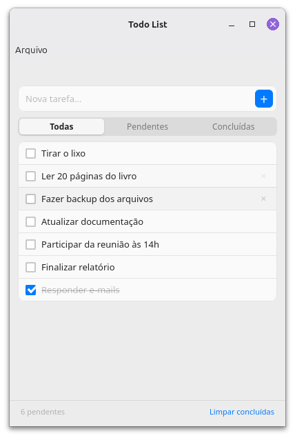

# Todo List - Deno Desktop

A native desktop application built with Deno Desktop and Webview.



## Requirements

- [Deno](https://deno.land/) installed on your system.
- [Deno extension](https://marketplace.visualstudio.com/items?itemName=denoland.vscode-deno)
  for VS Code (recommended).

## Development

```sh
deno task dev
```

## Build

```sh
deno task build
```

### Running on Linux (Post-Build)

The build process generates a standalone bundle folder (`TodoList/`). You can
run the application by executing the startup script via terminal:

```sh
cd TodoList
./TodoList
```

### Packaging for Linux (AppImage)

To generate a standalone `.AppImage` file for distribution, run the packaging
script after building:

```sh
deno task build:linux
```

This will create a `TodoList-x86_64.AppImage` file in your root directory.

## Code Formatting

This project uses Deno's built-in formatter. To ensure consistent code style across the project,
run:

```sh
deno fmt
```

Formatting rules and file exclusions are managed in [`deno.json`](./deno.json).

### VS Code Setup

If you use VS Code and have the **Prettier** extension installed, it may conflict with Deno's
formatter. To use Deno's formatter automatically on save, add the following to your
`.vscode/settings.json`:

```json
"[typescript]": {
  "editor.defaultFormatter": "denoland.vscode-deno"
},
"[typescriptreact]": {
  "editor.defaultFormatter": "denoland.vscode-deno"
}
```

## Known Issues

- **macOS Minimize Bug**: In the current experimental version of Deno Desktop,
  clicking the Dock icon does not restore a minimized window, making it
  unrecoverable without restarting the application.
- **Linux AppImage Icon Bug**: Building a Linux AppImage natively using the
  experimental command below fails to display the custom icon in many file
  managers:

  ```sh
  deno desktop -A --include src --output TodoList.AppImage main.ts
  ```

  The internal packager neglects to create the hidden `.DirIcon` symlink. To
  work around this, the `build:linux` task currently uses a custom script that
  leverages `appimagetool` to generate the `.DirIcon` symlink correctly.
